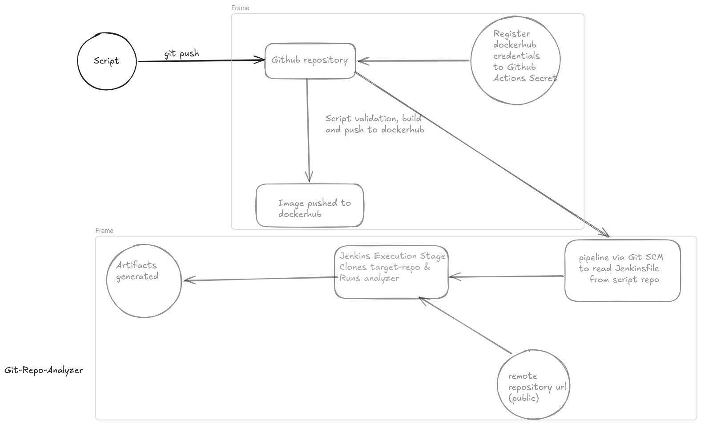

[](https://github.com/Aditya2274/Git-repo-analyzer/actions/workflows/docker-ci.yml)
# Git Repository Analyzer

A cross-platform, menu-driven CLI tool to analyze Git repositories and generate
detailed reports with charts and commit statistics.

The tool works natively on Linux/macOS, supports Windows users, and also provides
a fully Dockerized option for OS-independent execution.

---

## Features

### Interactive Menu
- Run Full Analysis
- Generate Charts Only
- Show Commit Summary
- Exit

### Full Analysis Includes
- Total commits
- Commits in the last 7 and 30 days
- Commits per author
- Lines added and removed
- Most modified files
- Stale branch detection (30+ days inactivity)
- Auto-generated Markdown report
- Embedded charts (PNG)

### Charts (Node.js / Chart.js)
- Commits per Author (bar chart)
- Daily Commit Activity (line chart)

Charts are stored in:
reports/charts/


### Markdown Report
All results are compiled into:


reports/summary.md


Charts are embedded directly in the report.

---

## Zero-Commit Repository Support

The analyzer safely handles:
- Empty repositories
- No commits
- Missing authors
- No file changes

This prevents common Git errors such as:fatal: ambiguous argument 'HEAD'


---

## Usage Options

### 1. Native (Linux / macOS)

```bash
chmod +x analyze2.sh
bash analyze2.sh
```

### 2. Docker (Recommended for Cross-Platform Use)

No dependencies required except Docker.

```bash
docker pull adityaashok2274/git-repo-analyzer:latest
```

```bash
docker run -it \
  --user $(id -u):$(id -g) \
  -v "$(pwd)":/repo \
  adityaashok2274/git-repo-analyzer:latest
```

This runs the analyzer safely as a non-root user and avoids permission issues.

---

## Automated CI/CD Architecture (GitHub Actions & Jenkins)



This project features a complete, decoupled CI/CD architecture using **GitHub Actions** for Continuous Integration (CI) and **Jenkins** for Continuous Delivery/Deployment (CD).

### 🚀 Continuous Integration (GitHub Actions)

**Focus: Validate the analyzer itself**

Upon every push to the repository, the GitHub Actions pipeline automatically:
1. Triggers on code push.
2. Builds the latest Docker image.
3. Validates analyzer execution on the current repository.
4. Pushes the Docker image directly to **Docker Hub** (`adityaashok2274/git-repo-analyzer:latest`).
5. Uploads validation artifacts.

*The CI pipeline ensures the analyzer image is valid, tested, and deployable.*

### 🧠 Continuous Delivery / Operational Automation (Jenkins)

**Focus: Operationally USE the analyzer on arbitrary repositories**

Jenkins acts as the operational automation layer, consuming the validated Docker image to perform dynamic remote repository analysis.

**Key CD Features:**
- **Dynamic Repository Analysis:** Uses parameterized builds to analyze *any* arbitrary GitHub repository dynamically.
- **Proper CI/CD Separation:** Pulls the validated artifact (`adityaashok2274/git-repo-analyzer:latest`) directly from Docker Hub.
- **Container Orchestration:** Executes the Dockerized analyzer operationally, running real deployment workloads.
- **Artifact Management:** Archives generated execution reports (`summary.md`, charts, etc.) as downloadable delivery artifacts.

**Jenkins Pipeline Implementation:**

```groovy
pipeline {
    agent any
    parameters {
        string(
            name: 'REPO_URL',
            defaultValue: 'https://github.com/octocat/Hello-World.git',
            description: 'GitHub Repository URL'
        )
    }
    stages {
        stage('Pull Latest Analyzer Image') {
            steps {
                sh 'docker pull adityaashok2274/git-repo-analyzer:latest'
            }
        }
        stage('Clone Target Repository') {
            steps {
                sh '''
                rm -rf target-repo || true
                git clone ${REPO_URL} target-repo
                '''
            }
        }
        stage('Run Git Repository Analyzer') {
            steps {
                sh '''
                docker run --rm \\
                  --user $(id -u):$(id -g) \\
                  -v $WORKSPACE/target-repo:/repo \\
                  adityaashok2274/git-repo-analyzer:latest
                '''
            }
        }
        stage('Archive Reports') {
            steps {
                archiveArtifacts artifacts: 'target-repo/reports/**/*', fingerprint: true
            }
        }
    }
}
```

### 🎯 Architecture Flow

```text
[ GitHub Actions (CI) ]  -->  Build + Validate Analyzer
           |
           v
[ Docker Hub ]           <--  Push Docker Image
           |
           v
[ Jenkins (CD) ]         -->  Pull Latest Image
                         -->  Clone Parameterized Target Repository (REPO_URL)
                         -->  Run Analyzer Container
                         -->  Generate & Archive Reports
```

*Summary:* Implemented a Jenkins-based CD pipeline to operationally consume validated Docker images, dynamically clone target repositories, execute containerized repository analysis workflows, and archive generated reports as delivery artifacts.

---

## Requirements (Non-Docker)

Git

Node.js 20+

Optional: npm, if you want to run the analyzer natively outside Docker.

The Docker image already includes the chart rendering dependencies. Native runs will
install the required Node packages on demand if they are missing.

License:
Open-source and free to use.
