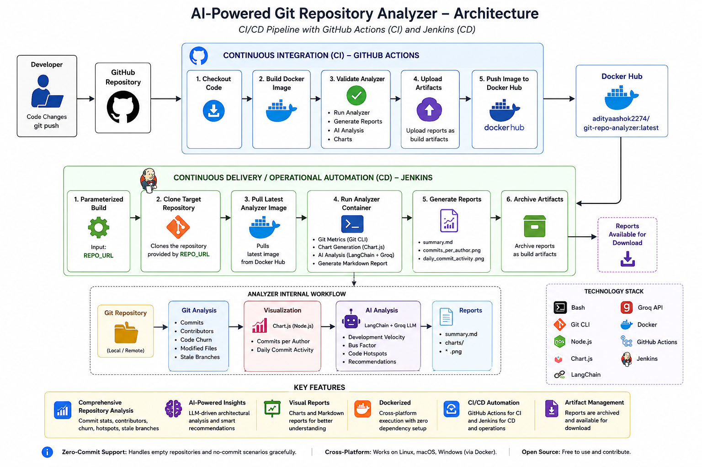

[](https://github.com/Aditya2274/Git-repo-analyzer/actions/workflows/docker-ci.yml)

# AI-Powered Git Repository Analyzer

An AI-powered, Dockerized Git Repository Analyzer that extracts repository health metrics, generates contributor and commit visualizations, and produces LLM-assisted architectural insights.

The project combines Git, Bash, Node.js, Chart.js, LangChain, Groq, Docker, GitHub Actions, Docker Hub, and Jenkins into an automated repository-analysis workflow.

---

## Architecture



The system is divided into two major automation layers:

- **GitHub Actions** — Continuous integration for building, validating, and publishing the analyzer image.
- **Jenkins** — Operational automation for consuming the validated Docker image and analyzing arbitrary remote Git repositories.

---

# Features

## Interactive Menu

The analyzer provides an interactive command-line menu:

1. Run Full Analysis
2. Generate Charts Only
3. Show Commit Summary
4. Exit

---

## Repository Analysis

The analyzer extracts:

- Total commits
- Commits in the last 7 days
- Commits in the last 30 days
- Commits per author
- Lines added
- Lines removed
- Most modified files
- Stale branches
- Repository activity information

---

## AI-Powered Architectural Analysis

When a Groq API key is available, the analyzer generates an AI-assisted architectural report using LangChain and Groq.

The AI analysis interprets repository metrics rather than simply displaying raw numbers.

It analyzes:

- Development velocity
- Contributor concentration
- Bus factor
- Code churn
- Repository hotspots
- Repository hygiene
- Branch activity
- Potential refactoring areas
- Architectural recommendations

The generated report is written as Markdown.

---

## Modular AI Reporting Architecture

The AI reporting functionality is separated into independent modules:

```text
ai/
├── chartGenerator.js
├── prompt.js
├── reportGenerator.js
└── providers/
    └── groqProvider.js
```

### Responsibilities

- `chartGenerator.js` — Generates repository activity charts using Node.js and Chart.js.
- `prompt.js` — Constructs the architectural-analysis prompt from Git metrics.
- `providers/groqProvider.js` — Handles communication with the Groq LLM through LangChain.
- `reportGenerator.js` — Orchestrates report generation and provides a static Markdown fallback when AI generation is unavailable or fails.

This separation keeps the AI pipeline modular and makes individual components easier to modify or replace.

### Static Report Fallback

The analyzer does not depend entirely on the AI service.

If `GROQ_API_KEY` is unavailable, or the AI request fails, the analyzer automatically generates a standard Markdown report.

The fallback report contains:

- Total commits
- Recent commit activity
- Commits per author
- Lines added and removed
- Most modified files
- Stale branches
- Repository charts

This allows the analyzer to continue producing useful output even when the external AI service is unavailable.

### Visualization

Charts are generated using Node.js and Chart.js.

Currently generated charts:

- Commits per Author — bar chart
- Daily Commit Activity — line chart

Charts are stored in:

```text
reports/charts/
```

Generated files:

- `reports/charts/commits_per_author.png`
- `reports/charts/daily_commit_activity.png`

### Markdown Report

The final analysis is generated at:

```text
reports/summary.md
```

The report contains repository metrics, AI analysis, recommendations, and embedded visualizations.

### Zero-Commit Repository Support

The analyzer safely handles repositories that contain no commits.

It handles:

- Empty repositories
- No commits
- Missing authors
- No file changes
- No commit history

This prevents common Git failures such as:

```text
fatal: ambiguous argument 'HEAD'
```

Charts are skipped when there is no commit history.

---

## Usage

### 1. Native Execution

Requirements:

- Git
- Node.js 20+
- Bash
- npm

Run:

```bash
chmod +x analyze2.sh
bash analyze2.sh
```

When chart dependencies are missing, the analyzer can install the required Node.js packages automatically.

### 2. Docker Execution

Docker is the recommended execution method because the analyzer and its required runtime dependencies are packaged into a container.

Pull the latest image:

```bash
docker pull adityaashok2274/git-repo-analyzer:latest
```

Run the analyzer against the current repository:

```bash
docker run -it \
  --user $(id -u):$(id -g) \
  -v "$(pwd)":/repo \
  adityaashok2274/git-repo-analyzer:latest
```

The target repository is mounted into `/repo`.

Running the container with the host user's UID/GID helps prevent generated reports from becoming owned by root.

---

## CI/CD Architecture

The project uses a decoupled automation architecture:

```text
GitHub Actions
      │
      │ Build + Validate + Publish
      ▼
Docker Hub
      │
      │ Pull validated image
      ▼
Jenkins
      │
      │ Clone target repository
      ▼
Analyzer Container
      │
      ├── Git Analysis
      ├── Chart Generation
      └── AI Analysis
              │
              ▼
           Reports
```

### Continuous Integration — GitHub Actions

GitHub Actions is responsible for validating and publishing the analyzer itself.

The workflow is triggered by pushes to the `main` branch or manually through `workflow_dispatch`.

The CI pipeline performs the following operations:

1. **Checkout** — Checks out the analyzer source code.
2. **Build Docker Image** — Builds the Docker image containing:
   - Bash analyzer
   - Git
   - Node.js
   - Chart.js dependencies
   - LangChain
   - Groq integration
   - AI reporting modules
3. **Push Image to Docker Hub** — The validated build artifact is published as `adityaashok2274/git-repo-analyzer:latest`.
4. **Validate Image** — A separate validation job pulls the newly published image and executes the analyzer against the repository checked out by GitHub Actions.
5. **Upload Validation Artifacts** — Generated reports are uploaded as GitHub Actions artifacts.

This ensures that the Docker image is tested before being consumed operationally by Jenkins.

### Jenkins Operational Automation

Jenkins consumes the Docker image published by GitHub Actions.

Its purpose is to operationally execute the analyzer against arbitrary Git repositories.

The Jenkins pipeline accepts a repository URL as a build parameter:

```text
REPO_URL
```

The workflow is:

1. Pull Latest Analyzer Image
2. Clone Target Repository
3. Run Analyzer Container
4. Generate Reports
5. Archive Reports

This allows the same analyzer image to be reused against different repositories without modifying the analyzer itself.

### Jenkins Pipeline

```groovy
pipeline {

    agent any

    parameters {
        string(
            name: 'REPO_URL',
            defaultValue: 'https://github.com/octocat/Hello-World.git',
            description: 'GitHub Repository URL'
        )
    }

    stages {

        stage('Pull Latest Analyzer Image') {
            steps {
                sh 'docker pull adityaashok2274/git-repo-analyzer:latest'
            }
        }

        stage('Clone Target Repository') {
            steps {
                sh '''
                    rm -rf target-repo || true
                    git clone ${REPO_URL} target-repo
                '''
            }
        }

        stage('Run Git Repository Analyzer') {
            steps {
                withCredentials([string(
                    credentialsId: 'groq-api-key',
                    variable: 'GROQ_API_KEY'
                )]) {
                    sh '''
                        docker run --rm \
                          --user $(id -u):$(id -g) \
                          -e GROQ_API_KEY="$GROQ_API_KEY" \
                          -v "$WORKSPACE/target-repo:/repo" \
                          adityaashok2274/git-repo-analyzer:latest
                    '''
                }
            }
        }

        stage('Archive Reports') {
            steps {
                archiveArtifacts artifacts: 'target-repo/reports/**/*',
                                 fingerprint: true
            }
        }
    }
}
```

The Groq API key is injected at runtime through Jenkins credentials rather than being stored in the Docker image.

### AI Workflow

```text
Git Metrics
     │
     ▼
Node.js Runtime
     │
     ▼
Prompt Builder
     │
     ▼
LangChain
     │
     ▼
Groq LLM
     │
     ▼
AI Architectural Analysis
     │
     ▼
Markdown Report
     │
     ▼
summary.md
```

If AI generation is unavailable:

```text
Git Metrics
     │
     ▼
Static Report Generator
     │
     ▼
summary.md
```

---

## Project Structure

```text
git-repo-analyzer/
├── analyze2.sh
├── Dockerfile
├── Jenkinsfile
├── package.json
├── package-lock.json
├── ai/
│   ├── chartGenerator.js
│   ├── prompt.js
│   ├── reportGenerator.js
│   └── providers/
│       └── groqProvider.js
├── reports/
│   └── charts/
├── .github/
│   └── workflows/
│       └── docker-ci.yml
└── git-repo-analyzer-updated.png
```

---

## Technology Stack

| Technology | Purpose |
| --- | --- |
| Bash | Repository analysis and orchestration |
| Git CLI | Repository metrics and history |
| Node.js | Chart and AI processing |
| Chart.js | Repository visualizations |
| LangChain | LLM integration |
| Groq | AI inference |
| Docker | Containerization |
| GitHub Actions | Continuous Integration |
| Docker Hub | Container image distribution |
| Jenkins | Operational automation and report generation |
| Linux | Runtime environment |

---

## Security

The Groq API key is not stored inside the Docker image.

For CI/CD execution, the key is supplied at runtime through the automation platform's secret/credential mechanism:

```text
GitHub/Jenkins Secret
        │
        ▼
Runtime Environment
        │
        ▼
GROQ_API_KEY
        │
        ▼
LangChain / Groq Provider
```

---

## Key Engineering Characteristics

- **Modular Architecture** — AI reporting responsibilities are separated into dedicated modules.
- **Containerized Execution** — The analyzer and its runtime dependencies are packaged into a Docker image.
- **CI Validation** — Every change can be automatically built and validated using GitHub Actions.
- **Reusable Artifact** — The Docker image published to Docker Hub can be consumed by Jenkins without rebuilding the analyzer.
- **Parameterized Automation** — Jenkins can analyze different Git repositories using the `REPO_URL` parameter.
- **Fault Tolerance** — The analyzer can generate a static report when AI generation is unavailable.
- **Cross-Platform Execution** — Docker provides a consistent runtime environment across supported host systems.
- **Zero-Commit Handling** — Repositories without commit history are handled gracefully instead of causing Git analysis failures.

---

## End-to-End Workflow

```text
Developer
    │
    │ git push
    ▼
GitHub Repository
    │
    ▼
GitHub Actions
    │
    ├── Checkout
    ├── Build Docker Image
    ├── Push Image
    ├── Pull Image
    ├── Validate Analyzer
    └── Upload Artifacts
            │
            ▼
        Docker Hub
            │
            ▼
          Jenkins
            │
            ├── Accept REPO_URL
            ├── Clone Repository
            ├── Pull Analyzer Image
            ├── Run Container
            └── Archive Reports
                    │
                    ▼
                summary.md
                charts/*.png
```

---

## Requirements

### Native Execution

- Git
- Bash
- Node.js 20+
- npm

### Docker Execution

- Docker

The Docker image contains the required runtime dependencies.

---

## License

Open-source and free to use.