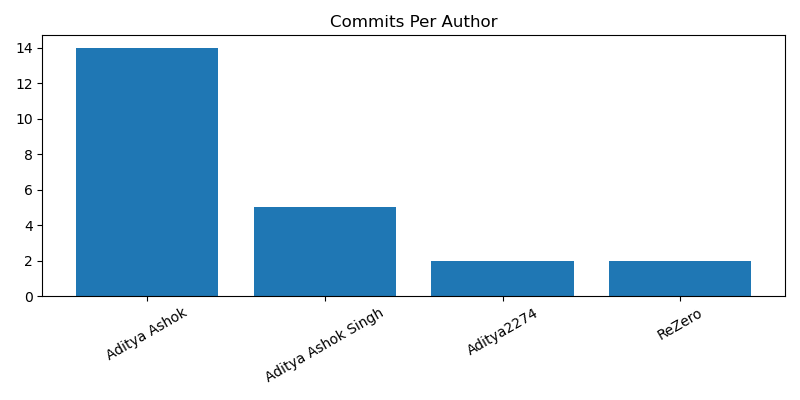
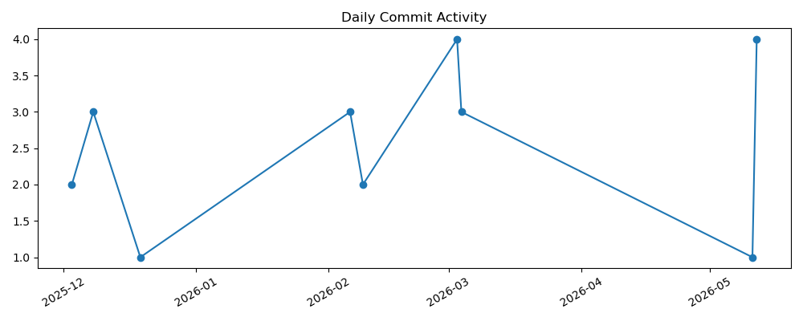

# Git Repository Analysis Report
Generated on: Wed May 13 12:22:17 UTC 2026

## Summary
- Total Commits: 23
- Commits last 7 days: 5
- Commits last 30 days: 5

## Commits Per Author
    14	Aditya Ashok
     5	Aditya Ashok Singh
     2	Aditya2274
     2	ReZero

## Code Changes
- Lines Added: 1603
- Lines Removed: 1044

## Most Modified Files
      8 .github/workflows/docker-ci.yml
      5 Readme.md
      4 analyze2.sh
      4 Dockerfile
      3 analyzer-win.sh
      3 README.md
      2 pom.xml
      2 git-learning

## Stale Branches

## Charts
### Commits Per Author

### Daily Commit Activity

